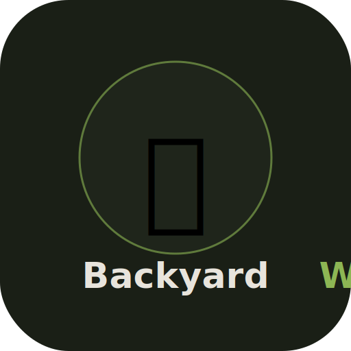

# 🌿 BackyardWild

A Progressive Web App (PWA) for tracking wild animals in your backyard. Log sightings with species, weather, behavior, video clips, and notes — then explore trends and stats over time.



## Features

- **Sighting Feed** — Chronological timeline of all your wildlife sightings with quick stats
- **Species Tracking** — 15 pre-loaded species across birds, mammals, reptiles, amphibians, and insects
- **Video Attachments** — Attach video clips from your phone's camera roll to any sighting
- **Weather & Behavior Logging** — Record conditions and animal behavior for each sighting
- **Stats Dashboard** — Category breakdowns, species leaderboard, weekly activity charts
- **Offline Support** — Works without internet via service worker caching
- **Persistent Storage** — Sightings saved to IndexedDB, survives browser restarts
- **iPhone Optimized** — Safe area support for notch/Dynamic Island, standalone home screen app

## Install on iPhone

1. **Deploy** the app (see below)
2. Open the URL in **Safari** on your iPhone
3. Tap the **Share button** (square with arrow)
4. Tap **"Add to Home Screen"**
5. Tap **Add**

The app launches full-screen with no browser chrome — just like a native app.

## Deploy

### Option A: GitHub Pages (free)

1. Fork or clone this repo
2. Go to **Settings → Pages**
3. Set source to **Deploy from a branch** → `main` → `/ (root)`
4. Your app will be live at `https://yourusername.github.io/backyard-wild/`

### Option B: Netlify Drop (free, instant)

1. Go to [app.netlify.com/drop](https://app.netlify.com/drop)
2. Drag the entire project folder onto the page
3. You'll get a live URL immediately

### Option C: Any static host

Upload all files to any static file host (Vercel, Cloudflare Pages, Tiiny.host, etc.). No build step required — it's just HTML, CSS, and JS.

## Project Structure

```
backyard-wild/
├── index.html        # The entire app (single-file PWA)
├── manifest.json     # PWA manifest for home screen install
├── sw.js             # Service worker for offline support
├── assets/
│   └── icon.svg      # App icon
├── .gitignore
├── LICENSE
└── README.md
```

## Customization

### Adding New Species

Open `index.html` and find the `ANIMALS` array near the top of the `<script>` tag. Add entries like:

```js
{ id: 16, name: "Wild Turkey", cat: "Bird", emoji: "🦃", color: "#6B4226" },
```

### Changing the Color Theme

All colors are defined as CSS variables in the `:root` block at the top of the `<style>` tag:

```css
:root {
  --bg: #1A1F16;        /* Background */
  --accent: #8DB654;    /* Green accent */
  --warm: #D4A053;      /* Gold/warm accent */
  /* ... */
}
```

## Tech Stack

- **Vanilla JS** — No framework, no build step, no dependencies
- **IndexedDB** — Client-side persistent storage
- **Service Worker** — Offline caching
- **CSS Variables** — Theming
- **Web App Manifest** — PWA install support

## Roadmap

- [ ] Photo attachments alongside video
- [ ] GPS location tagging per sighting
- [ ] Export sightings as CSV
- [ ] Custom species with user-uploaded icons
- [ ] Monthly/seasonal trend charts
- [ ] Share sightings with friends
- [ ] iNaturalist integration

## License

MIT — see [LICENSE](LICENSE)
